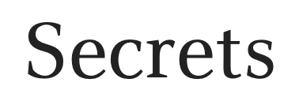

  

<h3 align="center">
  A platform where users can anonymously read or post secrets on a public forum. 
</h3>
<h4 align="center">
   Allows users to securely Register/Login with Email/Password or Google/Facebook.  
   Login information is encrypted, hashed, salted, and saved with OAuth and MongoDB.  
   Browsing sessions and saved with Cookies using Passport.js.
</h4>
<h1></h1>
<h3 align="center">Landing Page</h3>

  

<h3 align="center">Register or Login</h3>

  
  

<h3 align="center">Home page</h3>

  

<h3 align="center">Submit a Secret</h3>

  

<h3 align="center">Responsive</h3>

  

