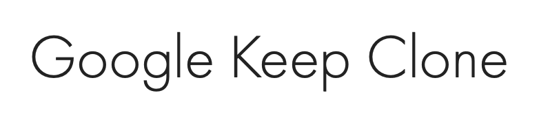
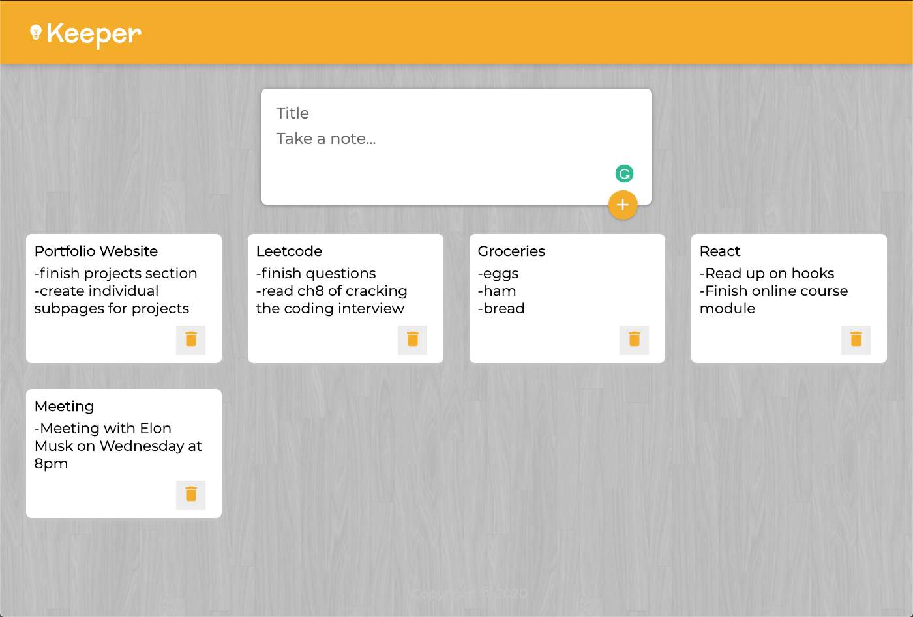
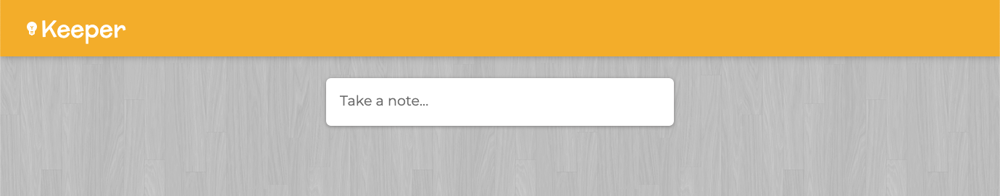
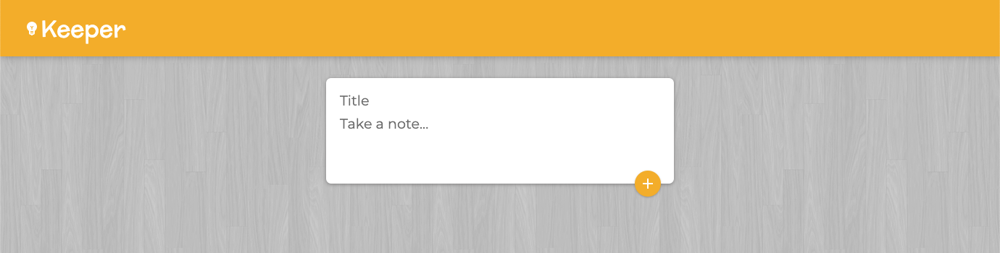

  

<h3 align="center">
  A Google Keep clone where users can create responsive note snippets. 
</h3>
<h4 align="center">
   Utilized JSX, Hooks, State Management, Containers, Virtual DOM, Declarative Programming, React, Babel, ES6, and Html/CSS
 to keep this web application highly responsive, modular, and easy to read.
</h4>
<h1></h1>
<h3 align="center">Home Page</h3>

  

<h3 align="center">Clean Interface</h3>

  
  

<h3 align="center">Responsive</h3>

  

